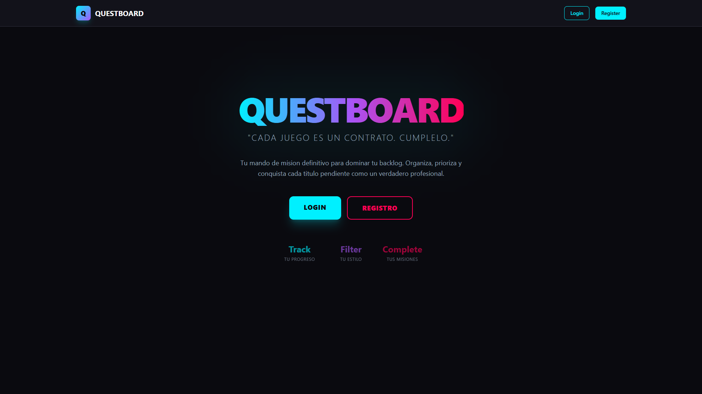
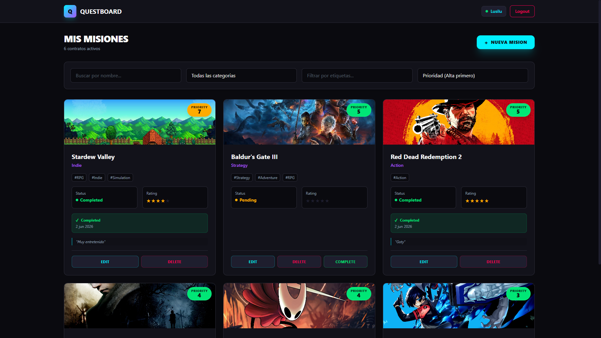
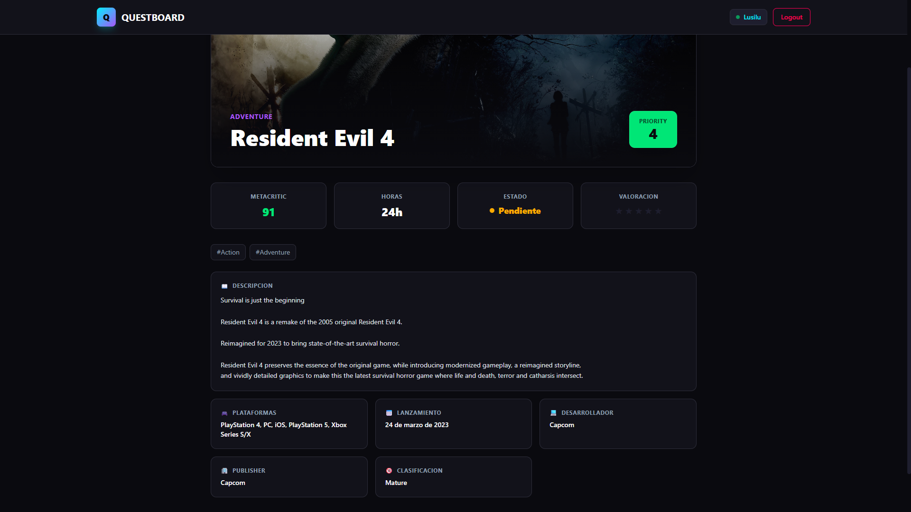

# 🎯 Questboard

> **"Cada juego es un contrato. Cumplelo."**

[](https://render.com)
[](https://vercel.com)
[](https://vuejs.org)
[](https://nuxt.com)
[](https://tailwindcss.com)
[](https://expressjs.com)
[](https://prisma.io)

---

## 📋 Índice

- [Descripción](#-descripción)
- [Tecnologías](#-tecnologías)
- [Arquitectura](#-arquitectura)
- [Funcionalidades](#-funcionalidades)
- [Screenshots](#-screenshots)
- [Estructura del Proyecto](#-estructura-del-proyecto)
- [Instalación y Uso Local](#-instalación-y-uso-local)
- [API REST](#-api-rest)
- [Despliegue](#-despliegue)
- [Autor](#-autor)

---

## 📝 Descripción

**Questboard** es una aplicación web fullstack diseñada para gamers que quieren dejar de acumular juegos sin terminar. Permite gestionar tu *backlog* de videojuegos, priorizar qué jugar siguiente mediante un algoritmo inteligente y llevar un registro de tus conquistas.

El núcleo de la aplicación es un **algoritmo de priorización** simple pero efectivo:

```
Prioridad = Puntuación Metacritic / Horas estimadas de juego
```

Más puntuación y menos horas = mayor prioridad. Así se maximiza la satisfacción y se reduce el abandono de títulos.

El proyecto ha sido desarrollado como trabajo final del curso **Desarrollo de Aplicaciones Web con IA** de la EOI (Escuela de Organización Industrial), dentro del programa FSE+.

---

## 🛠 Tecnologías

### Backend
| Tecnología | Versión | Propósito |
|------------|---------|-----------|
| **Node.js** | 20+ | Runtime de JavaScript |
| **Express.js** | 4.19 | Framework web para API REST |
| **Prisma ORM** | 5.13 | Mapeo objeto-relacional y migraciones |
| **SQLite / PostgreSQL** | — | Base de datos (SQLite en local, PostgreSQL en producción) |
| **bcryptjs** | 2.4 | Hash de contraseñas |
| **jsonwebtoken** | 9.0 | Autenticación JWT |
| **CORS** | 2.8 | Políticas de seguridad entre orígenes |

### Frontend
| Tecnología | Versión | Propósito |
|------------|---------|-----------|
| **Vue.js** | 3.5 | Framework reactivo de componentes |
| **Nuxt** | 3.16 | Framework fullstack sobre Vue (SSR, routing, layouts) |
| **Tailwind CSS** | 3.4 | Estilos utilitarios y diseño responsive |
| **Pinia** | 3.0 | Gestión de estado global |
| **Axios** | 1.8 | Cliente HTTP para consumir la API |

### Servicios Externos
- **[RAWG Video Games Database](https://rawg.io/)**: API de videojuegos utilizada para enriquecer los datos de los juegos (carátulas, descripción, plataformas, desarrolladora, etc.) mediante autocompletado inteligente en los formularios.

---

## 🏗 Arquitectura

El proyecto sigue una arquitectura **cliente-servidor** clásica con separación clara entre capas:

```
┌─────────────────┐         ┌─────────────────────────────┐
│   Nuxt 3 (SPA)  │  HTTP   │     Express.js API REST     │
│   -----------   │◄───────►│     -------------------     │
│  - Vue 3        │  JWT    │  - Controllers (MVC)        │
│  - Pinia        │         │  - Middlewares (Auth)       │
│  - Tailwind     │         │  - Routes                   │
│  - Axios        │         │  - Prisma ORM               │
└─────────────────┘         └─────────────────────────────┘
                                     │
                                     ▼
                            ┌─────────────────┐
                            │ SQLite / PG     │
                            │ - User          │
                            │ - Game          │
                            │ - Tag           │
                            └─────────────────┘
```

### Decisiones de diseño clave
- **API REST stateless**: Toda la comunicación se realiza mediante JSON y tokens JWT.
- **Autenticación JWT**: El token se almacena en `localStorage` y se envía en el header `Authorization: Bearer <token>`.
- **Middleware global de rutas**: Protección de rutas del frontend y redirecciones automáticas según el estado de autenticación.
- **Integración RAWG vía proxy backend**: La API key de RAWG nunca se expone al cliente. El frontend consulta al backend, que a su vez habla con RAWG.
- **Prioridad calculada al vuelo**: No se almacena en base de datos; se recalcula en cada lectura para mantener la consistencia.

---

## ✨ Funcionalidades

### Sprint 1 – API y Frontend básico
- [x] **Crear juegos** con nombre, categoría, horas, puntuación Metacritic y etiquetas.
- [x] **Listar juegos** con filtros por nombre, categoría y etiquetas.
- [x] **Ordenar juegos** por prioridad (alta/baja) y estado (completados/pendientes).
- [x] **Editar y eliminar** juegos con confirmación.
- [x] **Marcar como completado** con fecha automática, notas opcionales y valoración de 1 a 5 estrellas.

### Sprint 2 – Autenticación y Multi-usuario
- [x] **Registro de usuarios** con email, alias y contraseña encriptada (bcrypt).
- [x] **Login** con JWT de 24 horas de validez.
- [x] **Rutas protegidas**: `/juegos/*` requieren autenticación. `/login` y `/registro` redirigen si ya hay sesión.
- [x] **Aislamiento de datos**: cada usuario solo ve y gestiona sus propios juegos.
- [x] **Navbar dinámico**: muestra alias del usuario y botón de logout.
- [x] **Persistencia de sesión**: `localStorage` mantiene la sesión activa tras recargar la página.

### Extras implementados
- [x] **Búsqueda en RAWG**: autocompletado de juegos con carátula, puntuación y género. Rellena automáticamente los campos del formulario.
- [x] **Enriquecimiento de datos**: descripción, plataformas, desarrolladora, editora, fecha de lanzamiento y clasificación por edad (obtenidos de RAWG).
- [x] **Detalle de juego**: vista individual (`/juegos/:id`) con toda la información enriquecida y diseño hero.
- [x] **Diseño responsive**: adaptado a móvil, tablet y escritorio.
- [x] **UI/UX Dark Theme**: paleta de colores personalizada con estética gamer/cyberpunk (cyan, magenta, violeta).

> **Nota**: la página de perfil de usuario (`/perfil`) es la única funcionalidad opcional del entregable que no ha sido implementada.

---

## 📸 Screenshots

> A continuación se muestran capturas de pantalla representativas de la aplicación. El alumno deberá insertar aquí sus imágenes reales antes de la entrega.

### 1. Portada / Inicio de sesión

<p align="center">
  
</p>

### 2. Dashboard / Lista de juegos

<p align="center">
  
</p>

### 3. Detalles de un juego

<p align="center">
  
</p>

---

## 📁 Estructura del Proyecto

```
Questboard/
│
├── 📂 backend/
│   ├── .env                        # Variables de entorno
│   ├── package.json
│   ├── prisma/
│   │   └── schema.prisma           # Modelos User, Game, Tag
│   └── src/
│       ├── app.js                  # Punto de entrada de Express
│       ├── controllers/
│       │   ├── authController.js   # Registro y login
│       │   ├── gameController.js   # CRUD + completar juego
│       │   └── rawgController.js   # Proxy a RAWG API
│       ├── middlewares/
│       │   └── authMiddleware.js   # Verificación JWT
│       ├── routes/
│       │   ├── authRoutes.js       # /api/auth/*
│       │   ├── gameRoutes.js       # /api/games/*
│       │   └── rawgRoutes.js       # /api/rawg/*
│       └── lib/
│           └── prisma.js           # Instancia singleton de Prisma Client
│
├── 📂 frontend/
│   ├── nuxt.config.ts              # Configuración de Nuxt (incluye remap de rutas)
│   ├── tailwind.config.js          # Tema personalizado con paleta de colores
│   ├── package.json
│   └── app/
│       ├── app.vue                 # Root component
│       ├── assets/css/main.css     # Tailwind directives + scrollbar custom
│       ├── components/
│       │   ├── CompleteModal.vue   # Modal para valorar y completar juego
│       │   ├── GameCard.vue        # Tarjeta de juego individual
│       │   ├── GameForm.vue        # Formulario reutilizable (crear/editar)
│       │   └── Navbar.vue          # Barra de navegación con estado de auth
│       ├── layouts/
│       │   └── default.vue         # Layout base con Navbar + main container
│       ├── middleware/
│       │   └── auth.global.js      # Middleware global de protección de rutas
│       ├── pages/
│       │   ├── index.vue           # Home / Landing
│       │   ├── login.vue           # Inicio de sesión
│       │   ├── registro.vue        # Registro de usuario
│       │   └── games/
│       │       ├── index.vue       # Lista de juegos (dashboard)
│       │       ├── new.vue         # Crear juego
│       │       ├── [id].vue        # Detalle de juego
│       │       └── edit/
│       │           └── [id].vue    # Editar juego
│       ├── plugins/
│       │   └── init.client.js      # Inicialización de Pinia desde localStorage
│       ├── services/
│       │   └── axios.js            # Instancia de Axios con interceptores
│       └── stores/
│           └── auth.js             # Store Pinia (login, logout, persistencia)
│
└── 📂 info/                        # Documentación del entregable (PDFs y checklists)
```

### Mapeo de rutas (Nuxt)
El `nuxt.config.ts` incluye un hook `pages:extend` que mapea las rutas internas de Nuxt (`/games/*`) a las rutas públicas requeridas por el enunciado:

| Ruta interna Nuxt | Ruta pública | Descripción |
|-------------------|--------------|-------------|
| `/games` | `/juegos` | Lista de juegos |
| `/games/new` | `/juegos/nuevo` | Crear juego |
| `/games/edit/:id` | `/juegos/edicion/:id` | Editar juego |
| `/games/:id` | `/juegos/:id` | Detalle de juego |

---

## 🚀 Instalación y Uso Local

### Requisitos previos
- Node.js **v20+
- npm **v10+

### 1. Clonar el repositorio

```bash
git clone <URL_DEL_REPO>
cd Questboard
```

### 2. Configurar el Backend

```bash
# Instalar dependencias
npm install

# Configurar variables de entorno (copiar y editar)
cp .env.example .env   # o editar .env directamente

# Ejecutar migraciones de Prisma y generar cliente
npx prisma migrate deploy
npx prisma generate

# Levantar servidor en modo desarrollo
npm run dev            # http://localhost:3000
```

**Variables de entorno necesarias** (`.env`):
```env
PORT=3000
DATABASE_URL="file:./dev.db"      # SQLite en local
JWT_SECRET="tu_clave_secreta"
RAWG_API_KEY="tu_api_key_de_rawg"
FRONTEND_URL="http://localhost:3001"
```

### 3. Configurar el Frontend

```bash
cd frontend

# Instalar dependencias
npm install

# Levantar servidor de desarrollo
npm run dev            # http://localhost:3001
```

El frontend está configurado para apuntar a `http://localhost:3000/api` por defecto. En producción, la URL de la API se inyecta mediante la variable de entorno `API_BASE_URL`.

---

## 🔌 API REST

### Autenticación
Todos los endpoints de juegos requieren el header:
```
Authorization: Bearer <token_jwt>
```

### Endpoints

| Método | Endpoint | Descripción | Auth |
|--------|----------|-------------|------|
| `POST` | `/api/auth/register` | Registrar nuevo usuario | ❌ |
| `POST` | `/api/auth/login` | Iniciar sesión (devuelve JWT) | ❌ |
| `POST` | `/api/games` | Crear un nuevo juego | ✅ |
| `GET` | `/api/games` | Listar juegos del usuario (con filtros y orden) | ✅ |
| `GET` | `/api/games/:id` | Obtener detalle de un juego | ✅ |
| `PUT` | `/api/games/:id` | Editar un juego | ✅ |
| `DELETE` | `/api/games/:id` | Eliminar un juego | ✅ |
| `PATCH` | `/api/games/:id/complete` | Marcar juego como completado | ✅ |
| `GET` | `/api/rawg/search?q=...` | Buscar juegos en RAWG | ✅ |
| `GET` | `/api/rawg/games/:id` | Detalle de juego en RAWG | ✅ |

### Ejemplos de uso con cURL

**Registro de usuario:**
```bash
curl -X POST http://localhost:3000/api/auth/register \
  -H "Content-Type: application/json" \
  -d '{"email":"gamer@questboard.com","password":"123456","alias":"ProGamer"}'
```

**Login:**
```bash
curl -X POST http://localhost:3000/api/auth/login \
  -H "Content-Type: application/json" \
  -d '{"email":"gamer@questboard.com","password":"123456"}'
```

**Crear juego (requiere token):**
```bash
curl -X POST http://localhost:3000/api/games \
  -H "Content-Type: application/json" \
  -H "Authorization: Bearer <TU_TOKEN>" \
  -d '{
    "name": "Hollow Knight",
    "category": "Metroidvania",
    "hours": 25.5,
    "metacriticScore": 90,
    "tags": ["indie", "platformer", "souls-like"]
  }'
```

**Listar juegos filtrados:**
```bash
curl "http://localhost:3000/api/games?sortBy=metacriticScore&order=desc&name=Hollow" \
  -H "Authorization: Bearer <TU_TOKEN>"
```

**Completar juego:**
```bash
curl -X PATCH http://localhost:3000/api/games/1/complete \
  -H "Content-Type: application/json" \
  -H "Authorization: Bearer <TU_TOKEN>" \
  -d '{"rating":5,"notes":"Obra maestra absoluta."}'
```

---

## 🌐 Despliegue

La aplicación está desplegada y operativa en los siguientes entornos:

| Componente | Plataforma | Estado |
|------------|------------|--------|
| **Backend (API REST)** | [Render](https://render.com) | 🟢 Activo |
| **Frontend (Nuxt SPA)** | [Vercel](https://vercel.com) | 🟢 Activo |

> Los enlaces exactos de producción se proporcionarán junto a la entrega final.

### Pipeline de despliegue
1. **Render**: ejecuta `prisma migrate deploy` y levanta el servidor Node.js.
2. **Vercel**: compila la SPA de Nuxt e inyecta la variable `API_BASE_URL` apuntando al backend de Render.
3. **CORS**: configurado dinámicamente mediante la variable `FRONTEND_URL`, permitiendo múltiples orígenes separados por comas.

---

## 👨‍💻 Autor

**Lucía Mengual Ramírez**

- 📚 Curso: Desarrollo de Aplicaciones Web con IA — EOI (FSE+)
- 📅 Junio 2026
- 💻 Proyecto Final — Backend + Frontend

---

<p align="center">
  <strong>Questboard</strong> — Porque más vale que no sea eterno tu listado de juegos por terminar.
</p>
